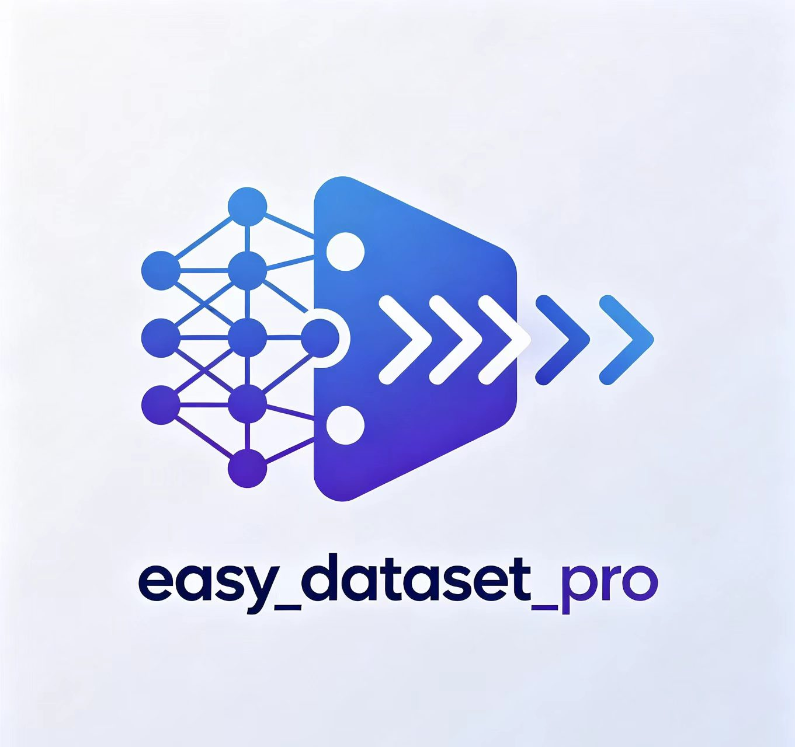

<p align="center">
  
</p>

<h1 align="center">Easy Dataset Pro</h1>

<p align="center">
  <b>基于知识图谱的 LLM 微调数据集生成与问答系统</b><br>
  <b>Graph-based Dataset Generation & QA System for LLM Fine-tuning</b>
</p>

<p align="center">
  <a href="#english">English</a> | <a href="#中文">中文</a>
</p>

---

## English

### Overview

Easy Dataset Pro is a system that leverages **knowledge graph construction** and **semantic retrieval** to generate high-quality training datasets for LLM fine-tuning. It processes raw documents (PDF, DOCX, etc.) through a multi-stage pipeline — OCR conversion, quality filtering, LLM compression — then builds a structured knowledge graph of entities and relationships. On top of this foundation, it generates self-contained Q&A pairs for fine-tuning datasets, and also provides a graph-aware QA system for validation and interactive use.

### Core Problem It Solves

Generating high-quality, domain-specific training data for LLM fine-tuning is expensive and labor-intensive. Easy Dataset Pro automates this by:

1. **Document Understanding** — Extracts structured knowledge from raw technical documents via knowledge graphs
2. **Training Data Generation** — Produces diverse, self-contained Q&A pairs that cover all key information points
3. **Quality Assurance** — Validates generated data through graph-aware retrieval and batch evaluation

### Key Features

- **Document Preprocessing Pipeline** — PDF/DOCX → Markdown (Docling OCR) → Quality Filtering (datatrove) → LLM Compression
- **Knowledge Graph Construction** — LLM-based entity/relation extraction, Neo4j persistence, community detection
- **Training Dataset Generation** — Auto-generates high-quality Q&A pairs for fine-tuning, with self-contained questions
- **Semantic Chunking** — Embedding-based document splitting that preserves contextual boundaries
- **Multi-Strategy Graph Retrieval** — Entity matching, N-hop expansion, community retrieval, shortest-path traversal
- **Reranking** — CrossEncoder (local) or OpenAI-compatible rerank API for precision
- **Batch Processing** — Resume-capable batch Q&A with checkpoint support for large-scale evaluation
- **State Persistence** — Save/load RAG state to avoid rebuilding
- **GEXF Export** — Export knowledge graphs for Gephi visualization

### Architecture

```
┌─────────────────────────────────────────────────────────────┐
│                   Document Preprocessing                     │
│  PDF/DOCX ──► Docling OCR ──► Quality Filter ──► LLM Compress │
└─────────────────────────────────────────────────────────────┘
                              │
                              ▼
┌─────────────────────────────────────────────────────────────┐
│              Knowledge Graph Construction                    │
│  Semantic Chunking ──► LLM Entity Extraction ──► Neo4j       │
│                              │                               │
│                              ▼                               │
│                    Community Detection (NetworkX)            │
└─────────────────────────────────────────────────────────────┘
                              │
                    ┌─────────┴─────────┐
                    ▼                   ▼
┌──────────────────────┐   ┌──────────────────────┐
│  Dataset Generation  │   │    Graph-aware QA     │
│  (Fine-tuning Data)  │   │  (Validation & Use)   │
│                      │   │                        │
│  LLM generates Q&A   │   │  Retrieval + Rerank    │
│  pairs from docs     │   │  + Generation          │
│  → JSONL output      │   │  → Answer with cite    │
└──────────────────────┘   └──────────────────────┘
                    │                   │
                    ▼                   ▼
┌─────────────────────────────────────────────────────────────┐
│              Batch Evaluation & Validation                    │
│  batch_query.py ──► Validate dataset quality at scale        │
└─────────────────────────────────────────────────────────────┘
```

### Project Structure

```
easy_dataset_pro/
├── graphrag/
│   ├── config/config.yaml              # Central configuration
│   └── src/
│       ├── main.py                     # GraphRAG orchestrator
│       ├── config/settings.py          # Settings dataclasses + YAML loader
│       ├── embeddings/embedder.py      # OpenAI + sentence-transformers
│       ├── similarity/                 # Cosine + DotProduct (Strategy pattern)
│       ├── chunking/semantic_chunker.py # Semantic chunking via embeddings
│       ├── graph/
│       │   ├── builder.py              # LLM extraction + Neo4j + community detection
│       │   └── retriever.py            # Multi-strategy graph retrieval
│       ├── generation/generator.py     # LLM answer generation with citations
│       ├── rerank/                     # CrossEncoder + OpenAI rerankers
│       └── preprocessing/              # Docling, quality filter, LLM compress, dataset generation
├── tests/                              # pytest test suite
├── assets/                             # Images (logo, QQ group)
├── run.py                              # CLI entry point
├── batch_query.py                      # Batch Q&A script
├── requirements.txt                    # Python dependencies
├── pyproject.toml                      # Project metadata
└── docs/
    └── tutorial.md                     # Step-by-step tutorial
```

### Quick Start

#### 1. Installation

```bash
git clone <repo-url>
cd easy_dataset_pro
python -m venv .venv
source .venv/bin/activate
pip install -r requirements.txt

# For document preprocessing (optional)
pip install docling pypdf onnxruntime
```

#### 2. Prerequisites

- **Neo4j** — Running instance (default: `bolt://localhost:7687`)
- **LLM API** — OpenAI-compatible endpoint (e.g., DeepSeek, OpenAI, Azure, local models)
- **Embedding API** — OpenAI-compatible or local sentence-transformers

#### 3. Configuration

Edit `graphrag/config/config.yaml`:

```yaml
# Embedding provider
embeddings:
  provider: openai
  model: text-embedding-v4
  openai_api_key: "your-key"
  openai_base_url: "https://your-api.com/v1"

# LLM for entity extraction & answer generation
llm:
  provider: openai
  model: gpt-4o
  api_key: "your-key"
  base_url: "https://your-api.com/v1"

# Neo4j connection
neo4j:
  enabled: true
  uri: bolt://localhost:7687
  user: neo4j
  password: "your-password"
```

#### 4. Generate Training Dataset

```bash
# Step 1: Preprocess documents (PDF/DOCX → clean Markdown)
python run.py preprocess --config graphrag/config/config.yaml

# Step 2: Generate Q&A pairs for fine-tuning
python run.py dataset --input-dir output/llm_compressed --output-dir output/dataset

# Step 3: Build RAG and validate with batch queries
python run.py rag-build
python batch_query.py --resume
```

### CLI Reference

| Command | Description |
|---------|-------------|
| `python run.py preprocess` | Document preprocessing pipeline (convert → quality → compress) |
| `python run.py dataset` | Generate Q&A pairs from Markdown for fine-tuning dataset |
| `python run.py rag-build` | Build RAG (load docs, chunk, build graph) and save state |
| `python run.py rag-query` | Load saved RAG state and query |
| `python run.py rag` | Legacy: build + query in one step |
| `python batch_query.py` | Batch Q&A for dataset validation with resume support |

### Configuration Reference

| Section | Key Settings | Description |
|---------|-------------|-------------|
| `similarity` | `strategy` | `cosine` or `dot_product` |
| `chunking` | `similarity_threshold`, `min/max_chunk_size` | Semantic split point detection and chunk merging |
| `embeddings` | `provider`, `model`, `openai_api_key`, `openai_base_url` | Embedding model configuration |
| `graph` | `extraction_model_name`, `max_entities_per_chunk`, `community_detection` | Graph extraction and community settings |
| `retrieval` | `max_entities`, `neighbor_hops`, `max_community_results` | Graph retrieval parameters |
| `llm` | `provider`, `model`, `api_key`, `base_url`, `temperature` | LLM generation settings |
| `neo4j` | `enabled`, `uri`, `user`, `password`, `database` | Neo4j connection |
| `rerank` | `enabled`, `provider`, `model`, `top_k`, `retrieve_k` | Reranking configuration |
| `batch` | `dataset`, `output`, `resume`, `save_interval`, `chain_of_thought` | Batch processing settings |
| `preprocessing` | `docs_dir`, `convert_*`, `quality_*`, `compress_*` | Preprocessing pipeline settings |

### Testing

```bash
pytest tests/ -v
```

### Community

<p align="center">
  
</p>

### License

MIT License. See [LICENSE](LICENSE) for details.

---

## 中文

<p align="center">
  
</p>

<h2 align="center">Easy Dataset Pro</h2>

### 概述

Easy Dataset Pro 是一个利用**知识图谱构建**与**语义检索**来生成高质量 LLM 微调训练数据集的系统。它将原始文档（PDF、DOCX 等）通过多阶段流水线处理 — OCR 转换、质量过滤、LLM 压缩 — 然后构建实体和关系的结构化知识图谱。在此基础上，它生成自包含的问答对用于微调数据集，同时也提供基于图谱的问答系统用于验证和交互使用。

### 解决的核心问题

为 LLM 微调生成高质量、领域特定的训练数据成本高昂且耗时。Easy Dataset Pro 通过以下方式实现自动化：

1. **文档理解** — 通过知识图谱从原始技术文档中提取结构化知识
2. **训练数据生成** — 产出多样化、自包含的问答对，覆盖所有关键信息点
3. **质量保障** — 通过图谱感知检索和批量评估验证生成数据的质量

### 核心特性

- **文档预处理流水线** — PDF/DOCX → Markdown（Docling OCR）→ 质量过滤（datatrove）→ LLM 压缩
- **知识图谱构建** — LLM 实体/关系提取、Neo4j 持久化、社区检测
- **训练数据集生成** — 自动生成高质量问答对，问题自包含，适用于微调
- **语义切分** — 基于 embedding 的文档切分，保持上下文边界
- **多策略图谱检索** — 实体匹配、N 跳邻居扩展、社区检索、最短路径遍历
- **重排序** — CrossEncoder（本地）或 OpenAI 兼容 rerank API 精排
- **批量处理** — 支持断点续传的批量问答，用于大规模评估
- **状态持久化** — 保存/加载 RAG 状态，避免重复构建
- **GEXF 导出** — 导出知识图谱用于 Gephi 可视化

### 架构

```
┌─────────────────────────────────────────────────────────────┐
│                     文档预处理流水线                           │
│  PDF/DOCX ──► Docling OCR ──► 质量过滤 ──► LLM 压缩          │
└─────────────────────────────────────────────────────────────┘
                              │
                              ▼
┌─────────────────────────────────────────────────────────────┐
│                    知识图谱构建                                │
│  语义切分 ──► LLM 实体提取 ──► Neo4j 存储                      │
│                    │                                         │
│                    ▼                                         │
│              社区检测 (NetworkX)                              │
└─────────────────────────────────────────────────────────────┘
                              │
                    ┌─────────┴─────────┐
                    ▼                   ▼
┌──────────────────────┐   ┌──────────────────────┐
│   数据集生成          │   │    图谱问答            │
│  (微调训练数据)       │   │  (验证与使用)          │
│                      │   │                        │
│  LLM 从文档生成       │   │  检索 + 重排序          │
│  问答对              │   │  + 生成                 │
│  → JSONL 输出        │   │  → 带引用的答案         │
└──────────────────────┘   └──────────────────────┘
                    │                   │
                    ▼                   ▼
┌─────────────────────────────────────────────────────────────┐
│                 批量评估与验证                                 │
│  batch_query.py ──► 大规模验证数据集质量                        │
└─────────────────────────────────────────────────────────────┘
```

### 项目结构

```
easy_dataset_pro/
├── graphrag/
│   ├── config/config.yaml              # 集中配置文件
│   └── src/
│       ├── main.py                     # GraphRAG 编排器
│       ├── config/settings.py          # 配置数据类 + YAML 加载
│       ├── embeddings/embedder.py      # OpenAI + sentence-transformers 嵌入器
│       ├── similarity/                 # 余弦 + 点积（策略模式）
│       ├── chunking/semantic_chunker.py # 基于 embedding 的语义切分
│       ├── graph/
│       │   ├── builder.py              # LLM 实体提取 + Neo4j + 社区检测
│       │   └── retriever.py            # 多策略图谱检索
│       ├── generation/generator.py     # LLM 答案生成（带引用）
│       ├── rerank/                     # CrossEncoder + OpenAI 重排序器
│       └── preprocessing/              # Docling、质量过滤、LLM 压缩、数据集生成
├── tests/                              # pytest 测试套件
├── assets/                             # 图片资源（logo、QQ 群）
├── run.py                              # CLI 入口
├── batch_query.py                      # 批量问答脚本
├── requirements.txt                    # Python 依赖
├── pyproject.toml                      # 项目元数据
└── docs/
    └── tutorial.md                     # 分步教程
```

### 快速开始

#### 1. 安装

```bash
git clone <repo-url>
cd easy_dataset_pro
python -m venv .venv
source .venv/bin/activate
pip install -r requirements.txt

# 文档预处理（可选）
pip install docling pypdf onnxruntime
```

#### 2. 前置条件

- **Neo4j** — 运行中的实例（默认：`bolt://localhost:7687`）
- **LLM API** — OpenAI 兼容端点（如 DeepSeek、OpenAI、Azure、本地模型）
- **Embedding API** — OpenAI 兼容或本地 sentence-transformers

#### 3. 配置

编辑 `graphrag/config/config.yaml`：

```yaml
# 嵌入提供者
embeddings:
  provider: openai
  model: text-embedding-v4
  openai_api_key: "your-key"
  openai_base_url: "https://your-api.com/v1"

# LLM（实体提取 + 答案生成）
llm:
  provider: openai
  model: gpt-4o
  api_key: "your-key"
  base_url: "https://your-api.com/v1"

# Neo4j 连接
neo4j:
  enabled: true
  uri: bolt://localhost:7687
  user: neo4j
  password: "your-password"
```

#### 4. 生成训练数据集

```bash
# 步骤 1：预处理文档（PDF/DOCX → 干净的 Markdown）
python run.py preprocess --config graphrag/config/config.yaml

# 步骤 2：生成问答对用于微调
python run.py dataset --input-dir output/llm_compressed --output-dir output/dataset

# 步骤 3：构建 RAG 并用批量查询验证
python run.py rag-build
python batch_query.py --resume
```

### CLI 命令参考

| 命令 | 说明 |
|------|------|
| `python run.py preprocess` | 文档预处理流水线（转换 → 质量过滤 → 压缩） |
| `python run.py dataset` | 从 Markdown 生成问答对，用于微调数据集 |
| `python run.py rag-build` | 构建 RAG（加载文档、切分、建图谱）并保存状态 |
| `python run.py rag-query` | 加载已构建的 RAG 状态并进行问答 |
| `python run.py rag` | 旧版：一步完成构建+查询 |
| `python batch_query.py` | 批量问答，用于数据集验证，支持断点续传 |

### 配置参考

| 配置段 | 关键参数 | 说明 |
|--------|---------|------|
| `similarity` | `strategy` | `cosine` 或 `dot_product` |
| `chunking` | `similarity_threshold`, `min/max_chunk_size` | 语义切分点检测和块合并 |
| `embeddings` | `provider`, `model`, `openai_api_key`, `openai_base_url` | 嵌入模型配置 |
| `graph` | `extraction_model_name`, `max_entities_per_chunk`, `community_detection` | 图谱提取和社区设置 |
| `retrieval` | `max_entities`, `neighbor_hops`, `max_community_results` | 图谱检索参数 |
| `llm` | `provider`, `model`, `api_key`, `base_url`, `temperature` | LLM 生成设置 |
| `neo4j` | `enabled`, `uri`, `user`, `password`, `database` | Neo4j 连接配置 |
| `rerank` | `enabled`, `provider`, `model`, `top_k`, `retrieve_k` | 重排序配置 |
| `batch` | `dataset`, `output`, `resume`, `save_interval`, `chain_of_thought` | 批量处理设置 |
| `preprocessing` | `docs_dir`, `convert_*`, `quality_*`, `compress_*` | 预处理流水线设置 |

### 社区

<p align="center">
  
</p>

### 测试

```bash
pytest tests/ -v
```

### 许可证

MIT 许可证。详见 [LICENSE](LICENSE)。
